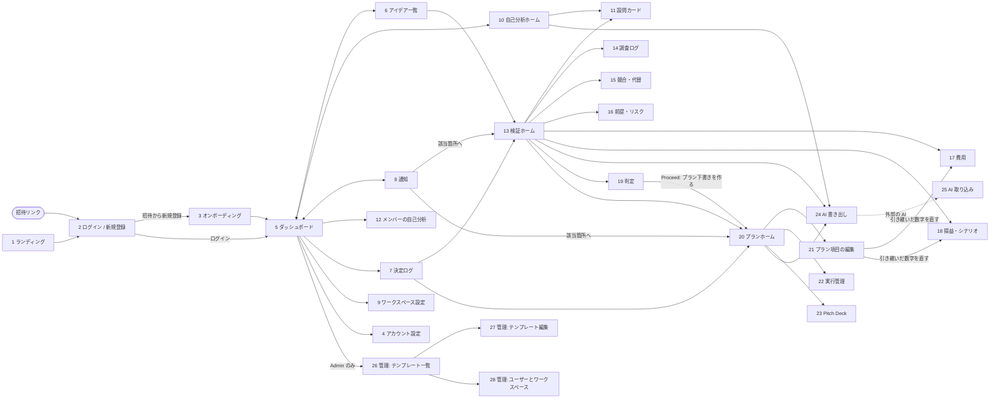

# 壁打ちメモ（Phase 1 成果物）

入力: `docs/concept.md`（Phase 0）と、BCDX の Google Drive にある現行テンプレートの調査結果（末尾の付録）。

## スコープ

- **フル機能**で作る。3工程（自己分析 → アイデア検証 → ビジネスプラン）について、入力・計算・進捗の可視化・プランへの引き継ぎを作る。さらに次の機能も含める。
  - AI 往復（書き出し、貼り付けての取り込み）
  - プランの実行管理
  - 決定ログとコメント
  - Pitch Deck
  - すべての変更履歴
  - 運営者の管理画面
- **初期リリースは招待制**にし、BCDX のみで試運転する。設計は一般公開を前提にし、誰でも登録できるようにするのは一般公開のときにする。
- 判断理由: BCDX が Drive での運用を丸ごと置き換えて使い込み、そのまま一般公開へ広げるため。
- 関連する決定
  - Google Drive の既存データ（自己分析1件、記入済みの検証1件）は手で入れ直す。Drive からの取り込み、Drive との同期、Drive への書き出しは作らない。
  - UI は英語にする。回答の言語は自由（英語・タガログ語・Hiligaynon・日本語・混在など）。多言語化できる作りは残す。
  - 通知はアプリ内のみ。メール通知は一般公開のときに検討する。
  - 金額は PHP を既定にする。通貨はワークスペースごとに設定する。
  - 収益化は保留し、当面は無料を前提に設計する。
  - AI はアプリに組み込まない（コンセプトどおり）。

## ロール定義

| ロール | 説明 | 権限 |
|--------|------|------|
| 運営者（Admin） | アプリ全体の管理者。ワークスペースのロールとは別の区分 | テンプレートの編集と公開（設問・EXAMPLE・確認項目のルール・費用行の初期値・AI 用プロンプト）。ユーザーとワークスペースの管理。招待の発行 |
| Owner | ワークスペースの管理者。登録時に自動で作られる個人用ワークスペースでは本人が Owner になる | Member の全権限。加えて、メンバーの招待・削除・ロール変更と、ワークスペース名・通貨の設定 |
| Member | ワークスペースの共同創業者 | アイデア・検証・プラン・実行管理の作成と編集、判定（Proceed / Hold / Drop）の記録、コメント、AI 往復、アイデアの複製。自分の自己分析の共有と、共有された自己分析の閲覧 |
| Viewer | アドバイザーや出資候補 | アイデア・検証・プラン・実行管理・Pitch Deck の閲覧とコメント。自己分析は共有済みでも見られない |

- 1人のユーザーが複数のワークスペースに所属できる。ロールはワークスペースごとに持つ。
- 自己分析は1人に1つ。本人が共有するまで、本人だけが見られる。共有先のワークスペースは本人が選ぶ（README の「各自で完了させてから議論する」に従う）。
- 判定は Member 以上なら誰でも記録できる。投票や承認の仕組みは作らない。誰が・いつ・なぜ判定したかを決定ログに残す。

## コアフロー

コアフローは「**アイデアを検証して判定する**」。アイデアの数だけ繰り返され、転記・抜け漏れ・計算の負担が最も集中する工程だから。

```
6 アイデア一覧 → 新しいアイデア（名前・一行コンセプト）
→ 13 検証ホーム（確認項目6つ・F/A/U の内訳・主要指標・セクション一覧・次のおすすめ）
→ セクションを好きな順に開いて入力する
   - 設問カード: 01 Customer & Problem / 02 Market / 10 Final Assessment の自由記述
   - リスト: 03 Research Log / 04 Competitors & Substitutes / 09 Assumptions・Risks
   - 数字: 05 Costs / 06 Unit Economics / 07 Scenario。08 Investment Return は自動で計算される
   - 回答と数字のそれぞれに F/A/U を付ける。Fact には根拠（調査ログか URL）を付ける
   - 行き詰まったら、セクションを AI 向けに書き出す → 外部の AI で整理する → 貼り付けて取り込む
→ 検証ホームに戻り、不足項目と Unknown を確認する（埋めるか、Unknown のまま残す）
→ 19 判定: Proceed / Hold / Drop と理由を入れる（不足項目を表示し、決定ログに記録する）
→ Proceed なら「プラン下書きを作る」→ 20 プランホーム
   Hold なら、後で再開して判定し直せる
```

### コアフローのルール

- **セクションの順番は自由**にする。検証ホームが、次に埋めると良いものを示す。
- **F/A/U**（Fact / Assumption / Unknown）は、設問への回答と数字の両方に付ける。数字とは、費用行・価格・営業日数・目標利益率・シナリオ別の販売数のこと。
  - Fact: 根拠が必須。根拠は調査ログの項目か URL。
  - Assumption: 確信度（Low / Medium / High）を付ける。確信度は Assumption だけに付ける。
  - Unknown: 分からないと分かっている状態。未入力とは区別する。
- **必須の確認項目6つは、入力内容から自動で判定**する。手でチェックはしない。
  1. 競合・代替が3〜5件
  2. 地元の価格帯
  3. 初期費用と月額費用
  4. 損益分岐量
  5. 許認可
  6. 需要か課題の外部シグナルが1件以上
- **点数は付けない。** 足りないものを状態として示す（現行の原則「恣意的なスコアで選ばない」）。
- **不足があっても Proceed できる。** 判定のときに不足項目を表示し、決定ログに残す。Proceed は「プランに進める価値がある」という意味で、立ち上げの承認ではない。
- **二重入力をなくす。** 原本では 00 Summary と 10 Final Assessment に同じ内容を手で写していた。アプリでは、検証ホームと判定画面が他のセクションから集約する。
- **計算はその場で行う。** 対象は損益分岐・シナリオ・投資回収・ROI。原本では、空のシナリオが 0 や赤字に見え、粗利がマイナスでも `IFERROR` で隠れていた。アプリでは、未入力を「未入力」、粗利のマイナスを警告で示す。
- **行数の上限をなくす。** 原本では、調査ログ20行・競合8行・前提5行・リスク6行だった。
- **費用行は、原本の行を初期値にして追加・削除できる**ようにする。金額のほか、価格の%（例: 原価 35%）や、仮置きのまとめ額でも入れられる。

### その他の主要フロー

- **自己分析**: 10 自己分析ホーム → 11 設問カードで1問ずつ答える（EXAMPLE をヒントとして表示）→ 必要なら AI 往復 → 完了 → 共有先のワークスペースを選んで共有する
- **プラン**: 20 プランホーム → 21 項目編集 → 22 実行管理 → 23 Pitch Deck（PDF 書き出し）
  - 検証から引き継いだ数字は、常に検証と連動する。
  - 文章（顧客・課題など）は、下書きを作るときにコピーする。その後はプラン側で直せる。
  - 1つのアイデアに複数のプラン（案A / 案B）を持てる。どの案も検証の数字を共有する。
- **AI 往復**: 24 書き出し → 外部の AI で整理 → 25 取り込み → 書き出し元の画面へ戻る
  - 書き出し: 範囲を選び、設問・これまでの回答・対話用プロンプトをコピーまたはダウンロードする。
  - 取り込み: 貼り付けた内容を設問ごとに振り分け、差分を確認してから反映する。

## 画面一覧

全画面をスマホと Web の両方で使える前提にする。

| # | 画面名 | 目的 | 簡易説明 | 対象ロール | 認証 |
|---|--------|------|----------|-----------|------|
| 1 | ランディング | アプリの紹介 | 何ができるか、招待制であること、ログインへの入口 | 全員 | 不要 |
| 2 | ログイン / 新規登録 | 認証 | 新規登録は招待リンクからのみ。初期リリースでは、誰でも登録できる受付を閉じておく | 全員 | 不要 |
| 3 | オンボーディング | 招待の受諾と初期設定 | 招待を受け、プロフィールを設定する。個人用ワークスペースは自動で作る | 全員 | 要 |
| 4 | アカウント設定 | 自分の情報 | プロフィール・パスワード | 全員 | 要 |
| 5 | ダッシュボード | ワークスペースの全体把握 | メンバーの自己分析の状況、アイデアごとの工程・判定・不足、期限の近いアクション、最近の動き | 全ロール | 要 |
| 6 | アイデア一覧 | アイデアを探す・作る | 工程・判定・提案者で絞り込む。新規作成（モーダル）、アイデアの複製 | 全ロール（作成・複製は Owner / Member） | 要 |
| 7 | 決定ログ | 決定の履歴 | 検証の判定とプランの決定。誰が・いつ・何を・なぜ決めたか、その時点の不足項目と主要指標 | 全ロール | 要 |
| 8 | 通知 | 自分宛ての動き | メンション、自分の項目へのコメント、判定、期限 | 全ロール | 要 |
| 9 | ワークスペース設定 | ワークスペースの管理 | 名前（後から変更可）・通貨・招待・ロール変更・メンバー削除 | Owner | 要 |
| 10 | 自己分析ホーム | 自己分析の全体 | 11セクションの進み具合、共有先の選択、AI 書き出し | 本人 | 要 |
| 11 | 設問カード | 1問ずつ答える | 回答・EXAMPLE・前後移動。自己分析・検証（01 / 02 / 10）・プランで共通に使う。検証では F/A/U と根拠も付ける | Owner / Member（自己分析は本人） | 要 |
| 12 | メンバーの自己分析 | 共有された自己分析を読む | 閲覧とコメント。共有済みのものだけ | Owner / Member | 要 |
| 13 | 検証ホーム | 検証の中心 | 確認項目6つの状態、F/A/U の内訳、主要指標（初期費用・損益分岐・Expected の利益・回収期間）、セクション一覧と進み具合、次のおすすめ、判定の履歴、このアイデアのプラン一覧 | 全ロール | 要 |
| 14 | 調査ログ | 根拠を残す | 日付・トピック・発見・出典の種類・URL・何を裏付けるか。件数の上限なし | 全ロール（編集は Owner / Member） | 要 |
| 15 | 競合・代替 | 競合を並べる | 競合カード（種類・対象顧客・提供内容・価格・強み・弱み・選ばれる理由・生き残る理由・出典）、生き残り / 失敗のパターン | 全ロール（編集は Owner / Member） | 要 |
| 16 | 前提・リスク | 前提とリスクを並べる | Assumptions（信じる理由・根拠・確信度・何で覆るか・次の確認）と Risks（確率・影響・重要な理由・対策・確かめ方） | 全ロール（編集は Owner / Member） | 要 |
| 17 | 費用 | 費用を入れる | 初期・月額固定・変動費の行。原本の行を初期値にし、追加・削除できる。金額か価格の%で入れ、F/A/U を付ける | 全ロール（編集は Owner / Member） | 要 |
| 18 | 損益・シナリオ | 計算を見る | 価格・営業日数・目標利益率・4シナリオの1日の販売数から、損益分岐・シナリオ表・投資回収・ROI を出す（原本の 06〜08） | 全ロール（編集は Owner / Member） | 要 |
| 19 | 判定 | Proceed / Hold / Drop | 判定と理由を入れる。不足項目と主要指標を表示し、決定ログに記録する | Owner / Member | 要 |
| 20 | プランホーム | プランの全体 | Part A / B の30項目の進み具合、検証から引き継いだ数字（参照のみ）、版、実行管理と Pitch Deck への入口 | 全ロール | 要 |
| 21 | プラン項目の編集 | プランを書く | 項目ごとの問いと回答、Example、検証データの参照。数字は検証側で直す | Owner / Member | 要 |
| 22 | 実行管理 | 実行を追う | マイルストーン・ローンチ計画・KPI・Open Questions・Next Actions（担当・期限・状態） | 全ロール（編集は Owner / Member） | 要 |
| 23 | Pitch Deck | 説明用のスライド | プランから毎回生成して表示し、PDF で書き出す。スライドは直接編集しない（中身はプラン側で直す） | 全ロール | 要 |
| 24 | AI 書き出し | 外部の AI に渡す | 範囲を選び、設問・回答・対話用プロンプトをコピーまたはダウンロードする。範囲は自己分析全体かそのセクション、検証のセクション、プランの項目 | Owner / Member | 要 |
| 25 | AI 取り込み | AI の結果を戻す | 貼り付け → 設問ごとに振り分け → 差分確認 → 反映 | Owner / Member | 要 |
| 26 | 管理: テンプレート一覧 | テンプレートの管理 | 自己分析・検証・プラン・AI プロンプト・確認項目のルールと、版の一覧 | Admin | 要 |
| 27 | 管理: テンプレート編集 | テンプレートの改訂 | 設問・EXAMPLE・ヒント・費用行の初期値を編集し、新しい版として公開する | Admin | 要 |
| 28 | 管理: ユーザーとワークスペース | 利用者の管理 | 一覧・利用状況・停止・招待の発行 | Admin | 要 |

独立した画面にせず、各画面の横に出すパネルとして扱うもの:

- **コメント**: 11〜23 の各項目の横に出す。メンションと返信ができる。
- **変更履歴**: 11〜22 の各項目の横に出す。誰が・いつ・何を変えたかと差分を見せ、元に戻せる。

## 画面遷移の全体像



### 分岐条件と補足

- **認証**: ログインなしで開けるのは、1・2 と招待リンクだけ。
- **新規登録**: 招待リンク経由に限る。招待はワークスペースの Owner（9）か運営者（28）が出す。誰でも登録できる受付は、初期リリースでは閉じておき、一般公開のときに開く。
- **登録時**: 個人用ワークスペースを自動で作る。本人が Owner になり、名前は 9 で後から変えられる（例: BCDX）。招待元のワークスペースにも、招待で指定されたロールで所属する。
- **ログイン後**: 最後に開いたワークスペースの 5 へ進む。ワークスペースはメニューから切り替える。
- **共通ナビ**: スマホは下のタブ、Web は左のサイドバーに出す。
  - タブ: 5 ダッシュボード / 6 アイデア / 10 自己分析 / 8 通知
  - メニュー: 7 決定ログ / ワークスペース切替 / 4 アカウント設定 / 9 ワークスペース設定（Owner）/ 26 管理（Admin）
- **Viewer**: 編集ボタン、19 判定、24 / 25 の AI 往復、自己分析タブ（10〜12）を表示しない。
- **12** に出るのは、共有済みの自己分析だけ。
- **25 で反映した後**は、書き出し元の画面（10 / 13 / 20）へ戻る。
- **Fact の根拠**は、入力中の画面からシートで付ける。既存の調査ログから選ぶか、新しく追加する。追加したものは 14 にも残る。
- **プラン下書き**は Proceed のときだけ作る。Hold のアイデアは、後で判定し直せる。同じアイデアに案を追加するときは、20 または 13 から作る。
- **21 では引き継いだ数字を直せない。** 数字の項目から 17 / 18 へ移り、検証側で直す。数字の違う案は、6 で「アイデアを複製」して別の検証として作る。

## データ構造（概要）

カラムの定義は Phase 2 で詰める。

```
User（ユーザー: 区分 一般 / Admin）
 ├─ N:M ─ Workspace（ワークスペース: 名前・通貨[既定 PHP]）
 │          中間: Membership（ロール Owner / Member / Viewer）
 ├─ 1:1 ─ SelfAnalysis（自己分析。テンプレートの版を参照）
 │          ├─ 1:N SelfAnalysisAnswer（回答。Q15〜17 は金額＋理由）
 │          └─ N:M Workspace（共有先）
 └─ 1:N ─ Notification（通知: メンション / コメント / 判定 / 期限）

Workspace
 ├─ 1:N Invitation（招待: メール・ロール。運営者も発行できる）
 ├─ 1:N Idea（アイデア: 名前・一行コンセプト・提案者・工程・最新の判定・複製元）
 │        ├─ 1:1 Validation（検証。テンプレートの版を参照）
 │        │        ├─ 1:N ValidationAnswer（01 / 02 / 10 の回答: F/A/U、Assumption の確信度）
 │        │        ├─ 1:N ResearchLogEntry（調査ログ）
 │        │        ├─ 1:N Competitor（競合・代替）＋ 生き残り / 失敗パターン
 │        │        ├─ 1:N Assumption（前提） / 1:N Risk（リスク）
 │        │        ├─ 1:N CostItem（費用行: 初期 / 月額固定 / 変動、金額 or 価格の%、F/A/U）
 │        │        └─ 1:1 Economics（価格・営業日数・目標利益率・4シナリオの1日の販売数。それぞれに F/A/U）
 │        │        ※ 根拠: 回答・費用行・数字などの各項目と ResearchLogEntry は N:M。URL を直接書いてもよい
 │        └─ 1:N BusinessPlan（プラン: 案A / 案B、版の名前。テンプレートの版を参照）
 │                 ├─ 1:N PlanAnswer（Part A / B の回答。文章は下書き作成時に検証からコピー）
 │                 └─ 1:N ExecutionItem（実行管理: 種類[マイルストーン / ローンチ / KPI /
 │                                       Open Question / Next Action]・担当・期限・状態）
 ├─ 1:N DecisionLogEntry（決定ログ: 対象[Idea / BusinessPlan]・種類[検証の判定 / プランの決定]・値・
 │                          理由・記録者・日時・その時点の不足項目と主要指標のスナップショット）
 ├─ 1:N Comment（コメント: 対象は各項目、作成者、メンション、返信）
 └─ ChangeHistory（変更履歴: 対象の項目ごとに 1:N。誰が・いつ・変更前後。元に戻すときに使う）

Template（テンプレート: 種類 自己分析 / 検証 / プラン。運営者が管理する）
 └─ 1:N TemplateVersion（版: 公開日時）
          ├─ 1:N TemplateSection → 1:N TemplateQuestion（問い・EXAMPLE・ヒント・回答の型）
          ├─ 確認項目のルール（6つ）
          ├─ 費用行の初期値
          └─ AI 用の対話プロンプト
```

### 保存しないもの（毎回計算・生成する）

- 損益分岐・シナリオ表・投資回収・ROI
- 確認項目の達成状況と F/A/U の内訳
- プランに表示する検証の数字（常に検証から読む）
- Pitch Deck

### データのルール

- **数字の正は検証に置く。** プランは数字を持たず、検証を参照する。数字の違う案は「アイデアを複製」して、別の検証にする。
- **テンプレートを改訂しても、既存の回答は作成時の版に固定する。** 最新版への移行は任意。移行するときは、一致する設問の回答を引き継ぐ。
- **変更はすべて履歴に残す。** 各項目の差分を見て、元に戻せる。
- **選択肢の値は原本を踏襲する。**
  - 判定: Proceed / Hold / Drop
  - 市場の種類: Red / Blue / Mixed
  - 確信度: Low / Medium / High
  - 削れるか（Can Reduce?）: Yes / Partly / No
  - 競合の種類: Direct Competitor / Indirect Competitor / Substitute
  - 出典の種類: Google Maps / Reviews, Website, Social Media, Public Data, News / Report, Store Observation, Price Check, Other

## 保留事項・未決定事項

**方針として後で決めるもの**
- 収益化の有無と方式（当面は無料前提）
- 一般公開（誰でも登録できる受付）の時期と条件
- メール通知（一般公開のときに検討）
- UI の多言語化（初期は英語のみ。多言語化できる作りは残す）
- 最初の運営者（Admin）をどう割り当てるか

**Phase 2 で詰めるもの**
- AI 書き出しの形式と、AI で整理した回答を設問ごとに振り分けるための書式
- Pitch Deck のスライド構成（現行のテンプレートが無いので、新しく設計する）
- 確認項目6つを自動で判定するルールの詳細。例: 「地元の価格帯」は競合の価格で数えるか、調査ログの Price Check で数えるか。「外部シグナル」は調査ログの何を数えるか
- アイデアの「工程」の定義（例: 検証中 / 判定済み / プラン作成中）
- プランの版（Version）の付け方と、変更履歴との役割分担
- プラン §11 Founder Roles: 原本は創業者3人固定。ワークスペースのメンバーから選ぶ形にするか
- プラン §24 Go / No-Go（立ち上げ / 延期 / 中止）の記録方法と、決定ログへの載せ方
- 損益分岐の端数処理（原本は切り上げていない）
- 調査ログそのものに Confidence（L/M/H）を残すか（回答の確信度は Assumption だけ、と決定済み）

**その他**
- 自己分析を変更履歴の対象にするか（本人しか編集しないため）
- 通貨: ワークスペースの通貨は PHP を既定にする。複数通貨の換算はしない想定（自己分析の例には JPY も出てくる）

---

## 付録: 現行テンプレートの構成（2026-10-01 時点の Drive 調査）

Phase 2 以降で Drive を読み直さなくて済むように、構造だけを残す。

### 運用の実態（README とフォルダ）

- **フォルダ構成**: 01 Self Analysis（1人1部）、02 Business Ideas（1アイデア1部）、03 Business Plans（まだ0件）。
- **権限**: フォルダは BCDX のグループ全員が編集できる。README には、権限や共有のルールは書かれていない。
- **手順**
  1. Self Analysis: 各自で行う。ChatGPT に `_initialize prompt` を渡し、1問ずつ答える。
  2. Business Ideas & Validation: 1人が複数のアイデアを出してよい。勝者を早く決めない。
  3. Business Plans: 複数のアイデアが進んでよい。
  4. Pitch Deck: 任意。プランから派生させ、別の正にしない。
- **原則**
  - 起業を答えとして押し付けない。
  - 1つに急いで絞らない。
  - 恣意的なスコアで選ばない。
  - 重要な前提を明示する。
  - 確信より証拠。
  - ビジネスは手段であり、目的ではない。
- **`_initialize prompt` の要点**
  - 1問ずつ聞き、最初の答えをそのまま受け取らずに深掘りする。
  - テンプレートに書く要約を作り、確認してから次へ進む。
  - 回答は利用者の言語のままにし、翻訳しない。
  - ビジネスアイデアの提案・順位付け・採点はしない。
  - 金額は PHP を既定にする。

### Self Analysis（36問）

| セクション | 問数 | 代表的な問い |
|---|---|---|
| WHY | 2 | Why do I want to build a business? |
| BE | 2 | In 5–10 years, what kind of person do I want to be? |
| DO | 3 | What do I want to spend more of my time doing? |
| GIVE | 3 | Who do I want to create value for? |
| HAVE | 4 | Where do I want to live? |
| PERSONAL INCOME | 3 | What is my minimum monthly personal income?（金額＋理由） |
| ENOUGH | 4 | At what point would additional income stop significantly improving my life? |
| NOT | 4 | What kind of success would actually feel like failure? |
| NOW | 5 | Time / Capital / Skills / Network-Resources / Current constraints |
| FINAL REFLECTION | 5 | My definition of self-fulfillment |
| ONE-SENTENCE SUMMARY | 1 | Describe the life I'm building in one sentence |

- 回答はすべて自由記述。例外は Q15〜17 で、Amount と「Why this amount?」の2つに分かれる。
- 全問に EXAMPLE の回答がある。各セクションには1行のガイダンスが付く。

### Business Idea & Validation（11シート）と画面の対応

| 原本 | 形 | 主な項目 | 画面 |
|---|---|---|---|
| 00 Summary | 単票 | 概要（Idea Name / Created By / Date / One-line Concept / Primary Customer / Core Problem / Proposed Solution / Market Type）、他シートから引く主要指標、Biggest Opportunity / Risk / Unknown、Decision | 13 検証ホーム、19 判定 |
| 01 Customer & Problem | 10問 | WHO / WHY THEM / BEHAVIOR / PROBLEM / FREQUENCY / SEVERITY / PAYMENT / SWITCHING / NON-CUSTOMER / PROOF。各問に Answer・Evidence/Source・Confidence | 11 設問カード |
| 02 Market | 15問 | CATEGORY / OCEAN（Red/Blue/Mixed）/ WHY / DRIVERS / BARRIERS / RED: 4問 / BLUE: 3問 / MARKET SIZE / REACHABLE / SHARE。RED 用・BLUE 用の問いは OCEAN の答えに応じて出し分ける | 11 設問カード |
| 03 Research Log | 表 | Date / Topic / Observation / Source Type / Source URL / What It Supports / Confidence | 14 調査ログ |
| 04 Competitors & Substitutes | 表 | Name / Type / Target Customer / Offering / Typical Price / Strength / Weakness / Why Customers Choose Them / Why They Survive / Source。加えて Survivor Patterns・Failure Patterns | 15 競合・代替 |
| 05 Costs | 3つの表 | 初期費用10行・月額固定8行・変動費6行（各表の行名は下記） | 17 費用 |
| 06 Unit Economics & Break-even | 単票 | 入力: Selling Price / Operating Days（既定 30）/ Target Operating Margin（既定 15%） | 18 損益・シナリオ |
| 07 Scenario Model | 5列 | Break-even / Conservative / Expected / Strong / Capacity Limit。入力は4シナリオの1日の販売数だけ | 18 損益・シナリオ |
| 08 Investment Return | 単票 | 回収期間、単純 ROI、「Is the return worth the capital and effort?」 | 18 損益・シナリオ |
| 09 Risks & Assumptions | 2つの表 | Assumptions（Assumption / Why We Believe It / Evidence / Confidence / What Would Disprove It / Next Check）、Risks（Risk / Probability / Impact / Why It Matters / Mitigation / How to Validate） | 16 前提・リスク |
| 10 Final Assessment | 単票 | 自由記述6問（Why might this work / fail / What must be true / Biggest unknown / risk / opportunity）、連動する指標、「Should we develop this into a full Business Plan?」→ Proceed / Hold / Drop、Why | 11 設問カード、19 判定 |

**05 Costs の行**

| 表 | 行数 | 行名 | 列 |
|---|---|---|---|
| 初期費用 | 10 | Equipment / Renovation / Lease Deposit / Permits / Initial Inventory / Branding / Launch Marketing / Tech Setup / Working Capital Buffer / Other | Cost / Why Needed / Source / Can Reduce? |
| 月額固定 | 8 | Rent / Salaries / Utilities / Internet-Software / Accounting / Base Marketing / Insurance-Compliance / Other | Cost / Source / Notes |
| 変動費（1販売あたり） | 6 | Materials / Packaging / Payment Fee / Delivery / Variable Labor / Other | — |

**計算式（原本）**

- 変動費/件 = 変動費行の合計
- 粗利（CP）= 価格 − 変動費/件
- 粗利率 = CP ÷ 価格
- 損益分岐の件数/月 = 月額固定費 ÷ CP
  - 1日あたり = 件数/月 ÷ 営業日数
  - 損益分岐の売上 = 件数/月 × 価格
- 目標利益率を達成する件数 = 月額固定費 ÷（CP − 価格 × 目標利益率）
- シナリオ: 件数/月 = 1日の販売数 × 営業日数
  - 売上 = 件数 × 価格
  - 営業利益 = 売上 − 変動費の合計 − 固定費
  - 営業利益率 = 営業利益 ÷ 売上
  - 価格と費用は全シナリオ共通で、変わるのは販売数だけ。
- 回収期間（月）= 初期費用の合計 ÷ Expected の月次利益。利益が 0 以下なら空欄にする。
- 単純 ROI = Expected の月次利益 × 12 ÷ 初期費用の合計
- 立ち上がり期間・税・割引は考慮しない。

**実例（Health × Food × Tech、判定 Hold）から分かったこと**

- 初期費用が埋まりきらず、利用者は「Startup Cost」を「Known Capital Floor」と書き換えていた。→ 未完成の状態を表示できるようにする。
- 原価を価格の % で置き、残りを「Other」にまとめていた。
- 根拠は、調査ログではなく外部の Google Doc へのリンクで書いていた。
- 空のシナリオが 0 に見えないよう、計算式を自分で書き換えていた。

### Business Plan（30項目）

ヘッダは Business Name / Version / Prepared By / Date。各項目は「問い・回答」の形で、Example が付く。
表の記号: [V] は検証データから引き継げる項目、[S] は自己分析を参照する項目、[T] は表形式の項目。

| # | 項目 | 記号・備考 |
|---|---|---|
| **Part A: Business Case** |||
| 1 | Executive Summary | [V] 主要な数字は 00 Summary と同じ |
| 2 | Vision & Purpose | [S] |
| 3 | Customer | [V] 01 |
| 4 | Problem | [V] 01 |
| 5 | Product / Service | |
| 6 | Market & Competition | [V] 02・04・06 |
| 7 | Positioning & Value Proposition | |
| 8 | Business Model | [V] 05〜07 |
| 9 | Sales & Marketing | [V] の一部 |
| 10 | Why Us | [S] NOW |
| **Part B: Execution Plan** |||
| 11 | Founder Roles | 原本は Founder 1〜3 の固定行 |
| 12 | Decision Making & Governance | 決定ログを含む |
| 13 | Ownership & Money Between Founders | |
| 14 | Legal & Company Setup | [V] 許認可 |
| 15 | Location / Facilities / Equipment | [V] 家賃、Capacity Limit |
| 16 | Suppliers & Inventory | |
| 17 | Operations | |
| 18 | People & Hiring | [V] 人件費 |
| 19 | Technology & Systems | |
| 20 | Financial Plan | [V] 4シナリオ・回収 |
| 21 | Key Assumptions | [T] [V] 09 |
| 22 | Key Risks | [T] [V] 09 |
| 23 | Pre-launch Milestones | [T] → 実行管理 |
| 24 | Go / No-Go Conditions | 立ち上げ / 延期 / 中止 |
| 25 | Launch Plan | [T] -30日 / -7日 / Launch / 最初の30日 / 31〜90日 → 実行管理 |
| 26 | KPI Scorecard | [T] 12個のプリセット → 実行管理 |
| 27 | Review Cadence | |
| 28 | Open Questions | [T] → 実行管理 |
| 29 | Next Actions | [T] → 実行管理 |
| 30 | Pitch-ready Summary | 1分版・5分版 → Pitch Deck の素材 |
